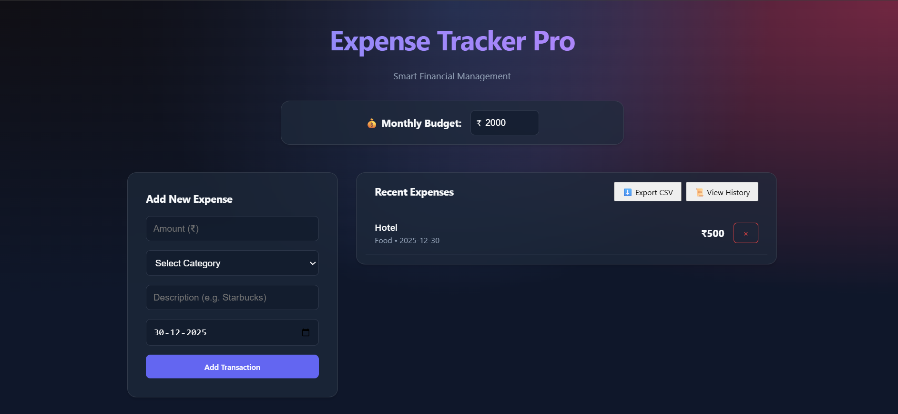
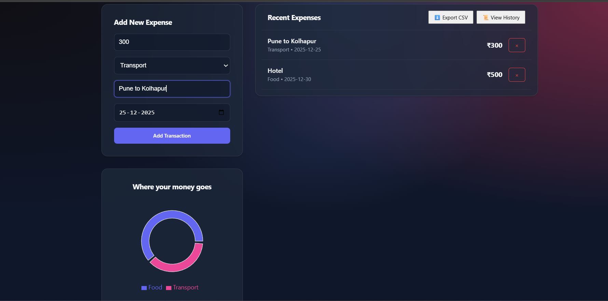

# ExpenseLens

A full-stack expense management system with AI insights.

## Tech Stack

*   **Backend**: Java, Spring Boot 3
*   **Frontend**: React (Vite), JavaScript
*   **Database**: PostgreSQL

## Getting Started

### Prerequisites

*   Java 17+
*   Node.js & npm
*   Docker (optional, for Database)

### 1. Database Setup

If you have Docker installed, run:
```bash
docker-compose up -d
```
This starts PostgreSQL on port 5432.

If you don't have Docker, install PostgreSQL locally and create a database named `expensetracker` with user `postgres` and password `password`.

### 2. Backend Setup

Navigate to the `backend` directory:
```bash
cd backend
./mvnw spring-boot:run
```
(Note: You may need to generate the maven wrapper first with `mvn -N io.takari:maven:wrapper`)
Alternatively, if you have maven installed:
```bash
cd backend
mvn spring-boot:run -Dspring-boot.run.arguments=--spring.datasource.password=YOUR_PASSWORD
# OR set the environment variable:
# Windows (PowerShell): $env:DB_PASSWORD='your_password'; mvn spring-boot:run
# Mac/Linux: DB_PASSWORD=your_password mvn spring-boot:run
```

### 3. Frontend Setup

Navigate to the `frontend` directory:
```bash
cd frontend
npm install
npm run dev
```

## 📸 Project Demo
| Dashboard & Stats | Add Expense Form  |
|:-----------------:|:-----------------:|
|  |   |

| Expense History| AI Advisor |
|:----------------:|:-----------:|
|  |  |

## Features

*   **Dashboard**: View detailed monthly summaries.
*   **Add Expense**: Log new expenses with categories and custom inputs.
*   **AI Insights**: Smart analysis of your spending habits with budget alerts.
*   **History Mode**: Track spending year-by-year and month-by-month.
*   **Export Data**: Download your financial records to CSV/Excel.
*   **Localized**: Fully customized for Indian Currency (₹).
